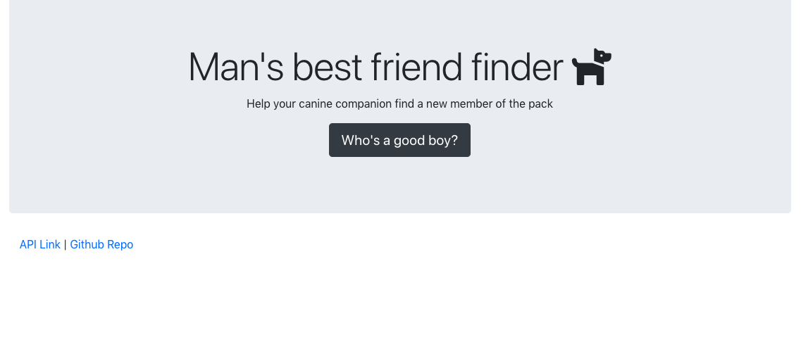

# Man's best friend finder

 Man's best friend finder is a full-stack site that takes in survey results and simulates a compatibility app by comparing those answers with those from other users. The app then display the name and picture of the user with the best overall match.

## Compatibility algorithm

The results algorithm determines the best match for the user based on the the absolute value of their survey responses. 

Using the array-sort npm package, the app takes the stored "best match" value, loops through the array of objects with the stored survey response value, then uses a bubble sort algorithm after to compare the user objects based on the total difference parameter resulting in the objects with the least total difference "bubbling up" and sorting in ascending order. The first first object in that array is the best match for the current user. 

## Technologies Used 

* [Bootstrap](https://getbootstrap.com/)
* [array-sort](https://www.npmjs.com/package/array-sort)
* [Express](https://www.npmjs.com/package/express)

